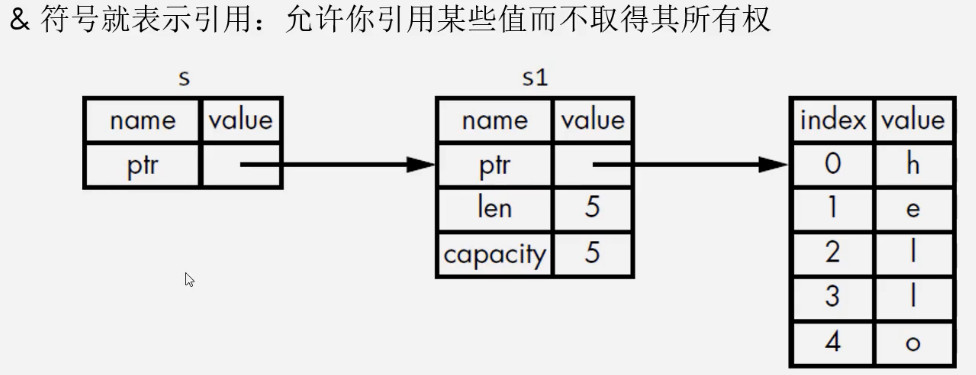
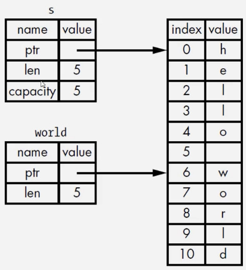

# Basic Grammar

- [Basic Grammar](#basic-grammar)
  - [Variable](#variable)
    - [Shadowing](#shadowing)
  - [DataTypes](#datatypes)
    - [integer value](#integer-value)
    - [float value](#float-value)
    - [bool value](#bool-value)
    - [character value](#character-value)
    - [tuple, list, vector](#tuple-list-vector)
    - [String](#string)
  - [Statements](#statements)
    - [function, expression](#function-expression)
    - [if-else](#if-else)
    - [loop, while, for](#loop-while-for)
    - [match](#match)
    - [`if let`](#if-let)
  - [Ownership](#ownership)
    - [ownership with function](#ownership-with-function)
    - [reference](#reference)
    - [slice](#slice)
  - [error handle](#error-handle)
    - [`panic!`](#panic)
    - [`Result<T, E>`](#resultt-e)

## Variable

变量
- 声明变量使用`let`
- 变量默认为immutable，使用`mut`关键字之后才能改变


常量: `const MAX_POINTS:u32=1000;`
- 常量不可以使用`mut`
- 常量需要`const`,类型必须指定
- 常量能够在任何作用域内声明，包括全局作用域
- 常量只能绑定到常量表达式，无法绑定到函数调用结果，或者运行时才计算的值
- 程序运行期间，常量在其声明的作用域内一直有效


```rs
const MAX_PONTS: u32 = 100_000; // is 100000, 为了增加可读性

fn main() {
    const MIN_PONTS: u32 = 100;
    let x = 5;
    // x=6;// error
    println!("x={}", x);
    let mut y = 10;
    y = 100;
    println!("y={}", y);
    println!("MAX_PONTS value={}", MAX_PONTS);
    print!("MIN_PONTS value={}", MIN_PONTS);
}
```

### Shadowing

可以使用相同名字声明新的变量，新的变量就会shadow(隐藏)之前声明的变量
- 使用`let`声明的同名新变量，也是immutable
- 使用`let`声明的同名新变量，可以是不同类型

```rs
fn main() {
    let x = 5;
    // x = x + 1; // error, x is immutable
    let x = x + 1; // shaowing

    let y = "hello";
    let y = y.len();

    let z="123456";
    let z:i32=z.parse().unwrap();
    
    println!("x={}", x); // 6
    println!("y={}", y); // 5
    println!("z={}", z); // 123456
}
```

## DataTypes

数据类型
- 标量类型: 代表一个单个的值
- 复合类型

```rs
fn main() {
    let x:i32 = 5;
    // x = x + 1; // error, x is immutable
    let x:i32 = x + 11; // shaowing

    let y:&str1 = "hello";
    let y:usize = y.len();

    let z:&str1="123456";
    let z:i32=z.parse().unwrap();
    
    println!("x={}", x); // 6
    println!("y={}", y); // 5
    println!("z={}", z); // 123456
}
```


### integer value

- signed: from $-(2^n-1)$, to $2^{n-1}-1$
- unsigned: from 0 to $2^n-1$
- arch由计算机架构决定，如果是64位计算机，isize就是i64

| Length  | Signed | Unsigned |
|---------|--------|----------|
| 8-bit   | i8     | u8       |
| 16-bit  | i16    | u16      |
| 32-bit  | i32    | u32      |
| 64-bit  | i64    | u64      |
| 128-bit | i128   | u128     |
| arch    | isize  | usize    |

除了`Byte`都可以使用类型后缀`98_222u32`, `98_222i32`
> 即便是在64位操作系统，i32的速度也很快

| Number Literals | Example     |
|-----------------|-------------|
| Decimal         | 98_222      |
| Hex             | 0xff        |
| Octal           | 0o77        |
| Binary          | 0b1111_0000 |
| Byte(u8 only)   | b'A'        |

### float value

- f32
- f64, 默认情况，现代计算机上f64和f32速度差不多，精度反而更高

### bool value

占用一个Byte
- true
- false

### character value

占用4个字节，unicode标量值

范围: `U+0000 ~ U+D7FF`, `U+E000 ~ U+10FFFF`

```rs
fn main() {
    let x='a';
    let y='😂';
    println!("x={}", x);
    println!("y={}", y);
}
```

### tuple, list, vector

```rs
fn main() {
    // Tuple: 元素类型可以不同
    let tup:(i32, f64,u8)=(100, 1.2, 2);
    let t=(1000, 1.3, 5);
    let (x, y, z)=t;
    println!("{},{},{}", tup.0, tup.1, tup.2);
    println!("{},{},{}", x, y, z);

    // Array, 元素类型相同，长度不许改变，数据存放在stack上
    let l=[1, 2, 3, 4, 5]; // immutable
    // 显式说是类型是f64,共3个元素
    let mut lx:[f64; 3]=[1.1, 2.2, 3.3]; // mutable
    lx[2]=20.3;
    // 重复多少次元素
    let ly=[2;3]; // [2, 2, 2]
    println!("{}", l[2]);
    println!("{}", lx[2]); // 20.3

    // Vector, 元素类型相同，长度可以改变
    let mut v : Vec<i32> = Vec::new();
    v.push(11);
    v.push(22);
    v.push(33);
    for i in v 
    { 
        print!("{} ",i); 
    } 

    let v2=vec![111, 222, 333]; // create by macro
    for i in v2
    {
        println!("{}", i)
    }
}
```

### String

```rs
fn main() {
    // String在heap上面分配
    let mut s1 = String::from("hello");
    s1.push_str(",world");
    println!("{}", s1); // hello,world
}
```

## Statements

### function, expression

```rs
fn main() {
    func1();
    func2(10);
    // 函数不需要定义在main之前
    // rust不支持函数默认参数
    println!("{}", func3()); // 10000
    println!("{}", func4(10)); // 15
    println!("{}", func5(1)); // 51
}

fn func1(){
    println!("func1");
}

fn func2(x:i32){
    println!("func2, x={}", x);
}

fn func3() -> i32{
    10000
}

fn func4(x:i32) -> i32{
    x+5 // 加了分号就是statemetn， 类型是Tuple，与返回值类型不匹配，报错
}

fn func5(x:i32) -> i32{
    return x+50;
}
```

```rs
fn main() {
    let y={ // 花括号说明是表达式
        let x=1;
        // x+3; // 加上末尾分号就是语句statement,语句的返回值是空的tuple
        x+3 // 不加末尾分号就是expression
    };
    // let z={let x=6}; // error, 认为是statement
    println!("{}", y); // 4
}
```

### if-else

```rs
fn main() {
    let x = 6;
    if x % 3 == 0 {
        print!("arm 1");
    } else if x % 3 == 1 {
        print!("arm 2");
    } else {
        print!("arm 3");
    }

    let num = if x % 2 == 0 { 100 } else { 200 }; 
    // let num = if x % 2 == 0 { 100 } else { "hello" }; // error, 两个分支必须是同种类型
    println!("num={}", num); // 100
}
```

### loop, while, for

```rs
fn main() {
    let mut counter=0;

    // 通过break跳出
    loop {
        counter+=1;
        println!("counter={}", counter);
        if counter==5{
            break;
        }
    }

    let mut x=0;
    while x<5 {
        x+=1;
        println!("x={}", x);
    }

    // 1..6表示range
    for i in 1..6 {
        println!("i={}", i);
    }

    // 逆序
    for i in (1..6).rev() {
        println!("i={}", i);
    }
}
```


```rs
fn main() {
    let mut counter = 0;

    // loop作为表达式
    let result = loop {
        counter += 1;
        if counter == 5 {
            break 2 * counter;
        }
    };

    println!("counter={}", counter); // 5
    println!("result={}", result); // 10
}
```

```rs
fn main() {
    let l = [1, 2, 3, 4, 5];
    let t=(10, 1.2, 'h', 1);
    for i in l.iter() {
        println!("value={}", i);
    }
    // 可以遍历Array, 无法遍历Tuple
}
```

### match

```rs
fn main() {
    let v = Coin::Quarter;
    println!("{}", value_in_cents(v)); // 25
}

enum Coin {
    Penny,
    Nickel,
    Dime,
    Quarter,
}

fn value_in_cents(coin: Coin) -> u8 {
    match coin {
        Coin::Penny => {
            // 多行代码的情况
            println!("Penny!");
            1
        },
        Coin::Nickel => 5,
        Coin::Dime => 10,
        Coin::Quarter => 25,
    }
}
```

```rs
fn main() {
    let v = Coin::Quarter(UsState::Alaska);
    println!("{}", value_in_cents(v)); // 25
}

#[derive(Debug)]
enum UsState {
    Alabama,
    Alaska,
}

enum Coin {
    Penny,
    Nickel,
    Dime,
    Quarter(UsState),
}

fn value_in_cents(coin: Coin) -> u8 {
    match coin {
        Coin::Penny => {
            println!("Penny!");
            1
        }
        Coin::Nickel => 5,
        Coin::Dime => 10,
        Coin::Quarter(state) => {
            // 拿到Quater里面存的值
            println!("State quarter from {:?}", state);
            25
        }
    }
}
```

`Option<T>` with `match`

```rs
fn main() {
    let v1 = Some(65);
    let v2 = plus_one(v1);

    println!("{}", v2.unwrap());
}

fn plus_one(x: Option<i32>) -> Option<i32> {
    // match 匹配必须穷举所有可能， 少写了None会报错
    match x {
        None => None, 
        Some(i) => Some(i + 1),
    }
}
```

```rs
fn main() {
    let v = 0u8;
    match v {
        1 => println!("one"),
        2 => println!("two"),
        3 => println!("three"),
        // 原则上u8应该256个数，需要穷举所有，现在只需要穷举1,2,3，所以用通配符_代替其他的
        _ => (),
    }
}
```

### `if let`

```rs
fn main() {
    let v = Some(0u8);

    // if let 和这个match等价，只处理一个分支的情况，放弃了穷举的可能
    match v {
        Some(3) => println!("three"),
        _ => (),
    }

    if let Some(3) = v {
        println!("three");
    }
}
```

```rs
fn main() {
    let v = Some(0u8);

    // if let 和这个match等价，只处理两个分支的情况
    match v {
        Some(3) => println!("three"),
        _ => println!("others"),
    }

    if let Some(3) = v {
        println!("three");
    } else{
        println!("others");
    }
}
```

## Ownership

所有权规则:
1. 每个值都有一个变量，这个变量是该值的所有者
2. 每个值同时只能有一个所有者
3. 当所有者超过作用域(Scope)的时候，该值将被删除

```rs
fn main() {
    let mut s=String::from("hello");
    s.push_str(",world");
    println!("{}", s);
} // s走出作用域(Scope)，调用drop函数，清理heap上面的内存
```

```rs
fn main() {
    let x = 5;
    let y = x;
    println!("{}", x); // 5, 因为x在stack分配，没有所有权的问题，在heap上分配才有所有权的问题
    println!("{}", y); // 5
    let s1 = String::from("hello");
    let s2 = s1;
    // println!("{}", s1); // error, 因为String在heap上分配，s1所有权转移到了s2(move), s1被Drop
    println!("{}", s2);
    
    let s3=s2.clone(); // 使用clone就会在heap上面再分配一块内存给s3，相当于是deep copy
    println!("{}", s2);
    println!("{}", s3);
}
```

概念:
- 在stack上面复制数据叫做copy
- 在heap上面复制数据叫做clone

Copy Trait: 用于能够完全存放在stack上面的数据类型
- 如果一个类型实现了Copy Trait, 那么旧变量在赋值后，仍然能够使用，比如上面的x
- 如果一个类型或者该类型的一部分实现了Drop Trait，那么该类型无法实现Copy Trait

拥有Copy Trait的类型:
- 任何简单标量的组合类型都是可以Copy的: integer, float, bool, char
- 需要分配内存或者某种资源的都不是Copy的
  1. Tuple里面所有元素都是Copy的，那么就是Copy的: (i32, f64);
  2. Tuple里面存在不是Copy的，那么就不是Copy的: (i32, String)


### ownership with function

> 将值传递给函数, Copy Trait发生复制，Drop Trait发生所有权移动

```rs
fn main() {
    let s=String::from("hello");
    take_ownership(s);
    // println!("{}", s); // error

    let x=1;
    make_copy(x);
    println!("{}", x); // x still work
}

fn take_ownership(str1:String) {
    println!("take {}", str1);
}// str1在这里被Drop

fn make_copy(num:i32) {
    println!("make copy {}", num)
}
```

> 函数返回的时候，也会发生所有权的移动

```rs
fn main() {
    let s1=give_ownership();
    println!("{}", s1);
    let s2=String::from("hello");
    println!("{}", s2); 
    let s3=take_and_giveback(s2);
    // println!("{}", s2); // s2丧失所有权
    println!("{}", s3);
}


fn give_ownership()->String {
    let str1=String::from("hello");
    str1
}


fn take_and_giveback(mut str1:String)->String {
    str1.push_str(",world");
    str1
}
```

一个变量的所有权总是遵循同样的模式
- 把一个值赋给其他变量时就会发生移动
- 当一个包含heap数据的变量离开作用域时，它的值就会被drop函数清理，除非数据所有权移动到另一个变量上

### reference

使用完s1，s1的所有权发生转移

```rs
fn main() {
    let s1 = String::from("hello");
    println!("{}", s1);
    let (s2, len) = take_and_giveback(s1);

    // println!("{}, {}", s1, len); // error, s1丧失所有权
    println!("{}, {}", s2, len);
}

fn take_and_giveback(str1: String) -> (String, usize) {
    let length = str1.len();
    (str1, length) // length的类型是usize
}
```

采用Reference, 使用完s1，s1的所有权发生不发生转移
> 

```rs
fn main() {
    let s1 = String::from("hello");
    println!("{}", s1);
    let len = calc_length(&s1);
    println!("{}", s1); // 使用了s1的值，但是s1的所有权在函数中未发生转移

    println!("{}", len); //5
}

fn calc_length(s: &String) -> usize { 
    s.len()
}
```

```rs
// 可变引用
fn main() {
    let mut s1 = String::from("hello");
    println!("{}", s1);
    let len = calc_length(&s1);
    println!("{}", s1); // 使用了s1的值，但是s1的所有权在函数中未发生转移

    println!("{}", len); //5
}

fn calc_length(str1: &mut String) -> usize { //表示引用的内容可以被修改
    str1.len()
}
```

可变引用的限制1：在特定的作用域内，对于某一块数据，只能有一个**可变引用**
> 在编译的时候，防止数据竞争

```rs
fn main() {
    let mut s = String::from("hello");
    let s1=&mut s;
    // let s2=&mut s;// error, 只能有一个可变引用

    println!("{},{}", s1, s2);
}
```

数据竞争发生的形式:
- 两个或者多个指针同时访问同一个数据
- 至少有一个指针用于写入数据
- 没有使用任何机制来同步对数据的访问

可以通过创建新的作用域，来允许非同时的创建多个**可变引用**

```rs
fn main() {
    let mut s = String::from("hello");
    {
      let s1=&mut s;
      println!("{}", s1);
    }

    let s2=&mut s;// error, 只能有一个可变引用
    println!("{}", s1);
}
```

可变引用的限制2: 不可以同时拥有一个**可变引用**  和 一个**不可变引用**
> 多个**不可变引用**是允许的

```rs
fn main() {
    let mut s = String::from("hello");
    let s1 = &s;
    let s2 = &s;
    // let s3 = &mut s; // error

    println!("{},{},{}", s1, s2, s3);
}
```

悬空指针(Dangling Reference): 一个指针引用了内存中的某个地址，而这块内存可能已经释放并分配给其他人使用
> Rust编译器能够保证引用永远都不是悬空指针：如果你引用了某些数据，编译器将保证在引用离开作用域之前，数据不会被销毁

s1离开作用域，对应的heap内存数据被销毁，但是返回了s1的引用s, s这个引用是失效的
> 

```rs
// 无法编译通过，
fn main() {
    let s=dangle();
}

fn dangle()->&String {
    let s1=String::from("hello");
    &s1
} // s1出了这一块就被销毁了，那么r将引用一个被销毁的数据，这就是悬空指针，rust编译器不允许
```

引用的规则
- 在任何时刻，只能满足下列条件之一
  - 一个可变引用
  - 任意数量不可变引用
- 引用必须一直有效
  - 比如上面`str1`在heap上面的数据被销毁了，但是返回了`&str1`，这个使用`&str1`不满足有效了

### slice

> 除了reference, 不持有所有权的数据类型: slice; slice本质是指向某一段数据的指针

```rs
fn main() {
    let li = [1, 2, 3, 4, 5];// type is [i32, 5]
    let slice = &li[1..3]; // [2, 3], type is &[i32]
}
```

```rs
fn main() {
    let s = String::from("hello world");
    let s1 = &s[..5]; // hello
    let world = &s[6..]; // world
    let s3:&str = &s[0..4]; // hell
    let whole_view1 = &s[0..s.len()]; // hello world
    let whole_view2 = &s[..]; // hello world

    let literal_str="hello grey";
}
```

> 

上文`&str`类型就是slice, `&str`是不可变引用
> 字符串字面值(比如上文literal_str)本质就是sliec, 即`&str`，直接存在在二进制程序中；因为`&str`是不可变引用，所以字符串字面值是不可变的。

```rs
fn main() {
    let mut s1 = String::from("hello grey");
    let index = first_world_index(&s1);
    s1.clear(); // 要求s1是mut
    println!("{}", index); // s1被清空，index仍然有效，如果后文索引[index]，会出现问题, 应该保证index与s1的同步性

    let mut s2 = String::from("james moriaty");
    let first_w = first_world(&s2);
    // s2.clear(); // error, 因为前文s2已经有一个不可变引用s，而s2.clear()使用的是可变引用，所以报错
    println!("{}", first_w);
}

fn first_world_index(s: &String) -> usize {
    let bytes = s.as_bytes();
    for (i, &item) in bytes.iter().enumerate() {
        if item == b' ' {
            return i;
        }
    }
    return s.len();
}

fn first_world(s: &String) -> &str {
    let bytes = s.as_bytes();
    for (i, &item) in bytes.iter().enumerate() {
        if item == b' ' {
            return &s[..i];
        }
    }
    return &s[..];
}
```

一般将`&str`作为参数类型， 这样既可以接受`&String`类型，又可以接收`&str`类型
- 如果传入的是`&String`, 会先创建一个`&str`然后进行后续处理
- 如果传入的是`&str`，直接进行处理

```rs
fn main() {
    let mut s2 = String::from("james moriaty");
    let first_w = first_world(&s2); // &String
    println!("{}", first_w);
    
    let first_w2=first_world(&s2[..]); //&str
    println!("{}", first_w2);

    let s3="tim cook";
    let first_w3=first_world(s3); // &str
    println!("{}", first_w3); // tim
}

fn first_world(s: &str) -> &str {
    let bytes = s.as_bytes();
    for (i, &item) in bytes.iter().enumerate() {
        if item == b' ' {
            return &s[..i];
        }
    }
    return &s[..];
}
```

## error handle

错误分类
- 可恢复的错误，采用`Result<T, E>`： 比如文件未找到
- 不可恢复的错误，采用`panic!`宏: bug, 访问越界

### `panic!`

panic宏动作
- 打印错误信息
- 展开(unwind), 清理调用栈(stack)
- 退出程序

当panic发生，可选两种方案
- 默认：程序展开调用栈(工作量大)
  - rust沿着调用栈往回走
  - 清理每个遇到的函数中的数据
- 非默认：立即终止调用栈(absort)，如果想要binary更小，在`Cargo.toml`配置
  - 不进行清理，直接停止程序
  - 内存需要OS清理

```toml
[package]
name = "hello-world"
version = "0.1.0"
edition = "2021"

[dependencies]
rand = "0.8.5" 

[profile.release]
panic = "abort"
```

查看详细的报错trace: 
> Linux: `RUST_BACKTRACE=1 cargo run`  
> Windows: `$env:RUST_BACKTRACE=1 ; cargo run`

```rs
fn main() {
    panic!("crash!");
}
```

或者直接配置

```rs
use std::env;

fn main() {
    // env::set_var("RUST_BACKTRACE", "full");
    env::set_var("RUST_BACKTRACE", "1");
    panic!("crash!");
}
```

为了获取带调试信息的回溯,直接使用`cargo run`, 而不能使用`cargo run --release`

### `Result<T, E>`

